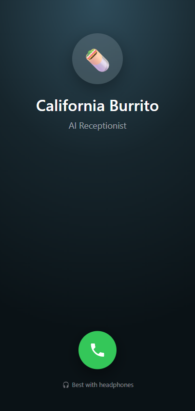
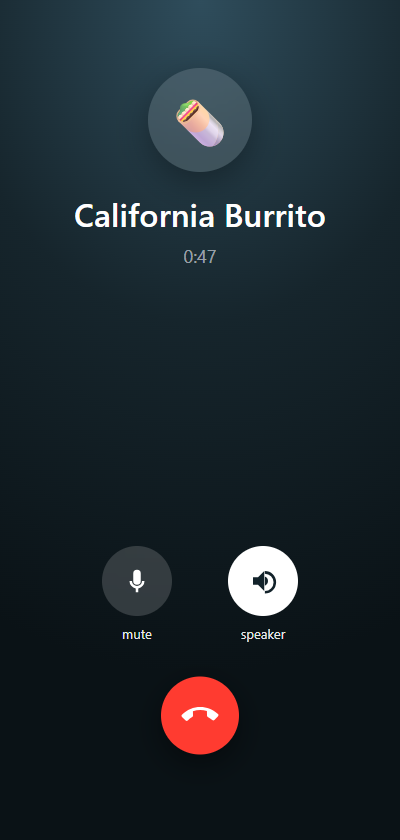

# 🌯 California Burrito — AI Voice Receptionist

> An AI phone agent that answers calls for a restaurant in **natural Indian-English** —
> handles customer queries, **books table reservations straight into Google Sheets**, and
> **escalates to human staff** when needed. Built to be indistinguishable from a real
> receptionist: low latency, barge-in aware, and it hangs up gracefully when you're done.

### 🔗 Live browser demo → **https://california-burrito-demo.vercel.app**
Opens an **iPhone-style call screen** — tap the green button and talk to the agent right in
your browser (use headphones). No phone needed.

<p align="center">
  
  &nbsp;&nbsp;&nbsp;
  
</p>
<p align="center"><sub>Real in-browser call screen: tap to call (left) → live timer, mute / speaker, and end-call (right).</sub></p>

<p align="center"><b>🎥 <a href="docs/media/demo-call.mp4">Watch a real call — with sound</a></b> — a full table booking, start to finish (~30s).</p>

<sub>*The demo streams to a self-hosted backend; if the demo is temporarily offline the backend isn't running.*</sub>

   

---

## What it does

- 📞 **Answers the phone** as the restaurant's receptionist — auto-greeting, natural turn-taking
- 🗺️ **Answers FAQs** — opening hours, location/address, and the full menu with prices &
  ingredients (looked up on demand via a `get_menu` tool, RAG-style, so the prompt stays small)
- 📅 **Books table reservations** → writes them **straight into a Google Sheet** (idempotent,
  with a spoken read-back so misheard names/dates are caught *before* they're saved)
- 🔎 **Looks up existing reservations** by phone or date
- 🙋 **Escalates / transfers to a human** for complaints, catering, or on request
- 🛑 **Ends the call gracefully** once the caller is done
- 🗣️ **Real Indian-English voice** (Sarvam Bulbul), plus **Hinglish** code-switching
- 🛡️ **Robust under adversarial input** — declines off-menu items, refuses prompt-injection,
  never invents prices, redirects food-order requests instead of dead-ending

---

## Architecture

```
 Caller ──► Twilio Media Streams ──►  bolna orchestrator (self-hosted, Docker)
                                        │   STT   Deepgram nova-3 (en-IN)
                                        │   LLM   OpenAI gpt-4o  (function calling)
                                        │   TTS   Sarvam Bulbul v3 (Indian voice)
                                        ▼
                         Tool webhooks (FastAPI) ──► Google Sheets
                         book_appointment · list_bookings · get_menu · transfer_call

 Browser demo ──► WebAudio + WebSocket (softphone) ──► same bolna agent  [deployed on Vercel]
```

---

## Tech stack

| Layer | Choice |
|---|---|
| Telephony | Twilio Media Streams (mulaw 8 kHz) |
| Speech-to-text | Deepgram **nova-3** (en-IN, keyterm-boosted with the menu vocabulary) |
| LLM | OpenAI **gpt-4o** with function calling (menu / booking / lookup / transfer tools) |
| Text-to-speech | **Sarvam Bulbul v3** — Indian voices, streaming |
| Orchestrator | self-hosted **bolna** (Docker: app + Redis + telephony) |
| Tool service | **FastAPI** + Pydantic, repository pattern (JSON dev / Google Sheets prod) |
| Data | **Google Sheets** via `gspread` service account |
| Browser demo | WebAudio + WebSocket softphone, **Vercel** |
| Public tool API | **Render** |

---

## Engineering highlights

- ✅ **Strict test suite that runs against the real model** — 33 conversation scenarios
  (FAQ, pricing, bookings, corrections, rejections **plus** hallucination, jailbreak,
  out-of-scope, multi-intent, angry-caller, past-date) + 12 unit tests, all green.
- 🩹 **~15 upstream fixes to bolna** — streaming tool-call accumulation, timezone, message
  sanitization, welcome pre-synthesis, and more (see `bolna_patches/`).
- 🧾 **Read-back safety net** — confirms name + party + day + time before writing, so bad STT
  can't silently save a wrong booking.
- 🍔 **Menu-as-tool (RAG-lite)** — moves a 60-item menu out of the every-turn prompt into a
  tool that returns only the queried slice → smaller, cheaper, faster prompts.
- ⚡ **Latency tuning** — Deepgram endpointing, streaming TTS, auto-greeting → ~1.5 s replies.
- 💰 **Full cost analysis** — self-host vs. managed, with break-even math → [`docs/COST_ANALYSIS.md`](docs/COST_ANALYSIS.md).
- 🔒 **Security-first** — no secrets in the repo or history; everything is env-based config.

---

## Repository layout

```
src/            FastAPI tool service (app, prompt builder, schemas, Sheets store)
scripts/        bolna agent generator, strict test runner, demo recorder, deploy scripts
tests/          unit tests (tools, store, schemas)
config/         business.yaml — hours, menu, prices, offers, booking rules (single source of truth)
docs/           architecture, integration guide, Google Sheets setup, COST_ANALYSIS.md, bolna_hosted/
bolna_patches/  patched files + apply script for the self-hosted bolna build
```

---

## Docs

- 💰 [Cost analysis: self-host vs managed](docs/COST_ANALYSIS.md)
- 🔌 [Bolna integration guide](docs/BOLNA_INTEGRATION.md)
- 📊 [Google Sheets setup](docs/GOOGLE_SHEETS_SETUP.md)
- 🚀 [Laptop quick-start](docs/LAPTOP_QUICKSTART.md)

---

## Notes

Built as an end-to-end, production-minded voice-AI system — not a toy: real telephony, real
tool-calling into a real datastore, a strict adversarial test suite, cost modelling, and a
shareable live demo. Menu and location are the real California Burrito (Kondapur, Hyderabad);
this is an independent engineering project, not affiliated with the brand.

*MIT licensed.*
